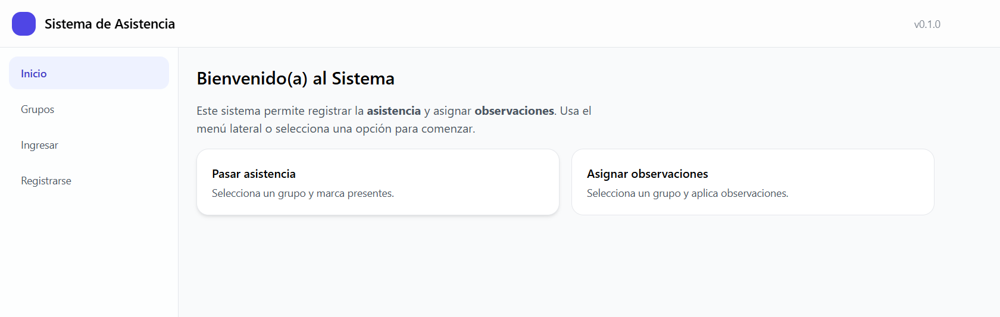
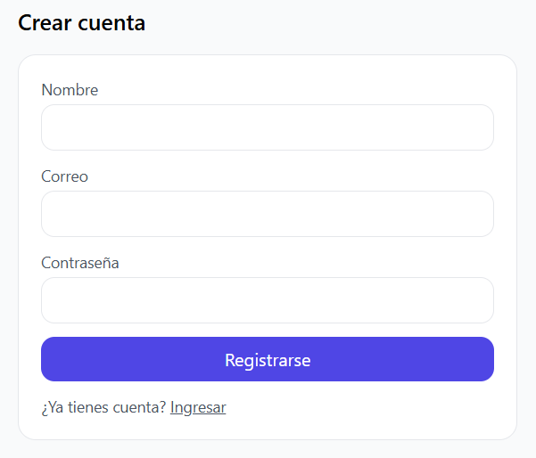
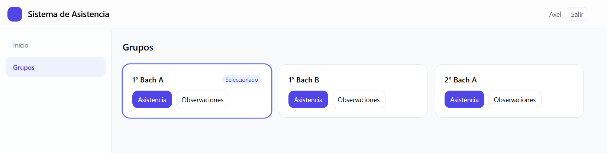
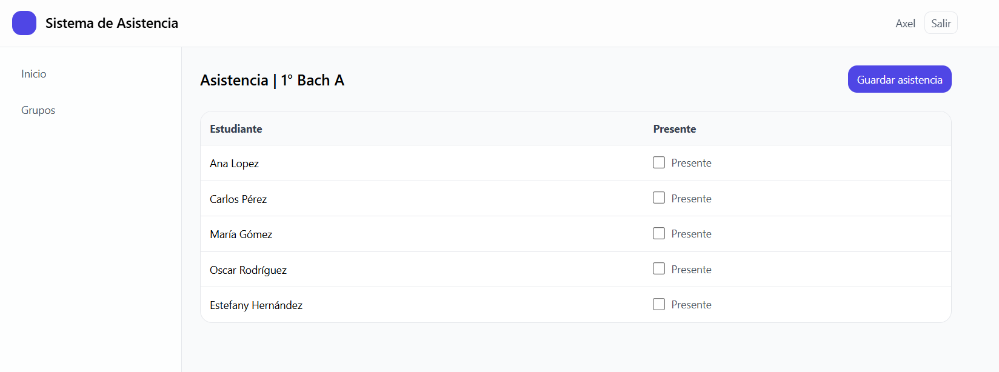
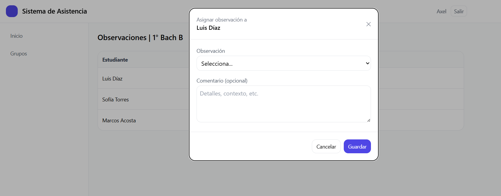

# 🧾 Sistema de Control de Asistencias y Observaciones Docentes

Aplicación web desarrollada con **React + Tailwind (frontend)** y **Spring Boot + SQL Server (backend)**.  
Permite a los docentes registrar **asistencias** y **observaciones** por grupo, autenticarse con JWT, y persistir los datos en una base de datos relacional.

---

## Tecnologías Principales

| Capa | Tecnologías |
|------|--------------|
| **Frontend** | React + Vite, React Router, TailwindCSS |
| **Backend** | Java 17, Spring Boot 3.3, Spring Security (JWT), JPA (Hibernate) |
| **Base de Datos** | Microsoft SQL Server 2019+ |
| **Build & Tools** | Maven, Node.js, npm |
| **Seguridad** | Autenticación y Autorización JWT, CORS configurado |

---

## Estructura del Proyecto

```
asistencia/
├── asistencia-backend/
│   ├── src/main/java/com/axel/asistencia/
│   │   ├── auth/                 → Login, registro, JWT
│   │   ├── domain/               → Entidades JPA (User, Group, Student, etc.)
│   │   ├── repo/                 → Repositorios JPA
│   │   ├── service/              → Lógica de negocio
│   │   ├── web/                  → Controladores REST
│   │   └── util/                 → Configuración y utilidades
│   └── resources/
│       ├── application.yml
│       └── application-sqlserver.yml
│
└── asistencia-frontend/
    ├── src/
    │   ├── pages/                → Pantallas (Home, Grupos, Asistencias, Observaciones, Login, Registro)
    │   ├── components/           → Componentes UI (Header, Sidebar, modales, toasts)
    │   ├── context/              → AuthContext (manejo global de sesión JWT)
    │   ├── services/             → API REST (fetch al backend)
    │   └── layout/               → Layout principal
    └── vite.config.js
```

---

## Funcionalidades

### Autenticación
- Registro de usuario (nombre, correo, contraseña)
- Inicio de sesión con JWT
- Mantenimiento de sesión con `localStorage`
- Protección de rutas mediante `PrivateRoute`

### Grupos y Estudiantes
- Consulta dinámica desde SQL Server (`/api/groups` y `/api/groups/{id}/students`)
- Persistencia de relaciones grupo–estudiante
- Interfaz intuitiva para seleccionar grupo y registrar asistencia u observaciones

### Asistencias
- Checkbox “Presente” por estudiante
- Envío masivo al backend (`POST /api/attendance`)
- Guardado persistente en la BD

### Observaciones
- Lista de observaciones predefinidas (`observation_catalog`)
- Modal para asignar observación y comentario
- Registro con fecha (`POST /api/observations/assign`)

### Seguridad
- Tokens JWT firmados con secreto definido por variable de entorno `JWT_SECRET`
- Protección de endpoints `/api/**`
- CORS configurado para `http://localhost:5173`

---

## Instalación y Ejecución

### Clonar el repositorio
```bash
git clone https://github.com/tuusuario/asistencia.git
cd asistencia
```

### Configurar la base de datos (SQL Server)


#### De forma local
Crea la base `asistencia` en tu SQL Server:
```sql
CREATE DATABASE asistencia;
```
Guarda un par de registros en cada tabla para probar el funcionamiento correcto.

---

### Configurar variables de entorno

En el backend (`asistencia-backend`):

**Windows (PowerShell)**
```powershell
$env:DB_URL="jdbc:sqlserver://localhost:1433;databaseName=asistencia;encrypt=true;trustServerCertificate=true"
$env:DB_USER="sa"
$env:DB_PASS="YourStrong!Passw0rd"
$env:JWT_SECRET="cambia-esto-por-un-secreto-largo"
```

---

### Ejecutar el backend
```bash
cd asistencia-backend
mvn spring-boot:run
```

El servidor se ejecutará en:  
[http://localhost:8080](http://localhost:8080)

---

### Ejecutar el frontend
```bash
cd asistencia-frontend
npm install
npm run dev
```

La aplicación estará disponible en:  
[http://localhost:5173](http://localhost:5173)

---

## Endpoints principales del backend

| Método | Endpoint | Descripción |
|---------|-----------|-------------|
| **POST** | `/api/auth/register` | Registrar nuevo usuario |
| **POST** | `/api/auth/login` | Autenticarse y obtener JWT |
| **GET** | `/api/auth/me` | Validar token y obtener usuario actual |
| **GET** | `/api/groups` | Listar todos los grupos |
| **GET** | `/api/groups/{id}/students` | Listar estudiantes por grupo |
| **POST** | `/api/attendance` | Guardar asistencia de grupo |
| **GET** | `/api/observations/catalog` | Listar observaciones predefinidas |
| **POST** | `/api/observations/assign` | Asignar observación a estudiante |

---

## Tablas principales

| Tabla | Descripción |
|--------|-------------|
| `users` | Usuarios registrados (docentes) |
| `groups` | Grupos de clase |
| `students` | Estudiantes asociados a un grupo |
| `attendance` | Registro de asistencia (por fecha y grupo) |
| `attendance_item` | Detalle por estudiante |
| `observation_catalog` | Lista base de observaciones posibles |
| `observation_assignment` | Observaciones asignadas a estudiantes |

---

## Seguridad y buenas prácticas
- Encriptación de contraseñas con `BCryptPasswordEncoder`.
- Tokens JWT con tiempo de expiración configurable.
- Protección CSRF deshabilitada (para APIs REST).
- CORS limitado al frontend (localhost:5173 por defecto).
- Compilación Java con flag `-parameters` para compatibilidad con Spring 6+.

---

## Capturas de pantalla







---

**📘 Licencia:** Proyecto académico para fines educativos y de demostración.  
© 2025 — Desarrollado por Universidad Don Bosco - Campus Soyapango.
